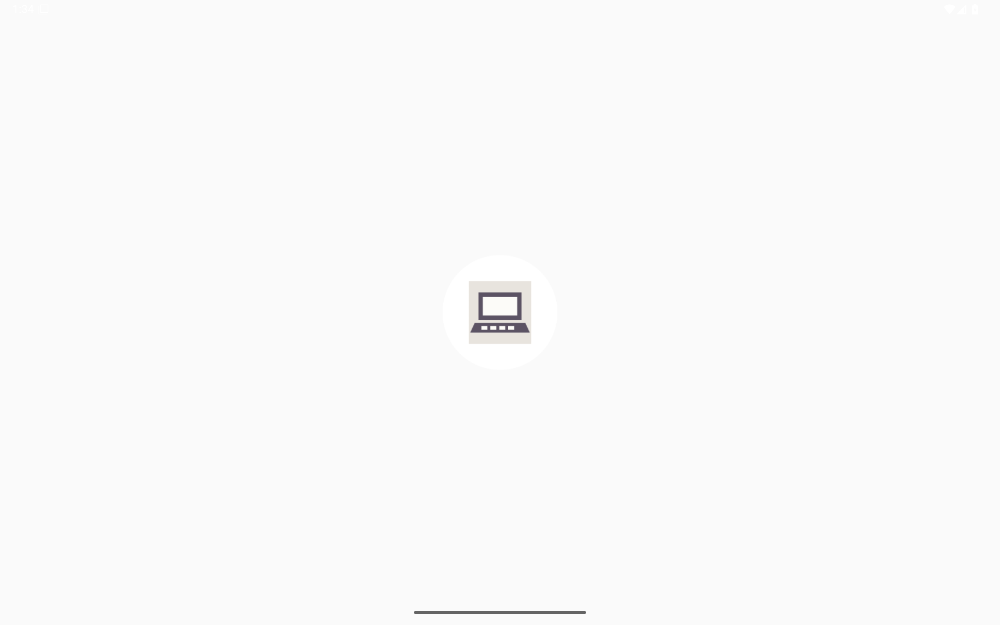
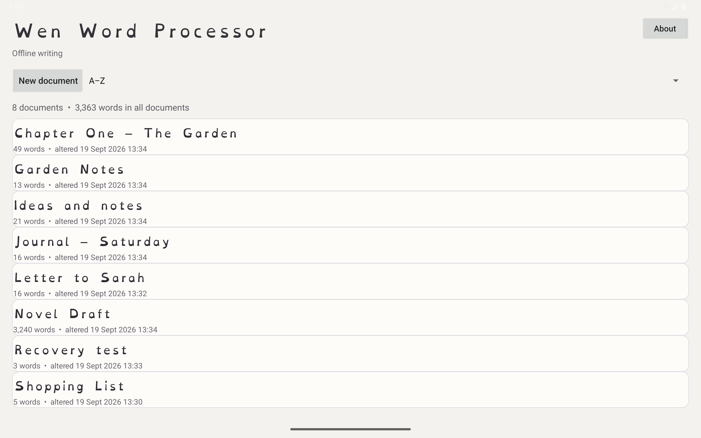
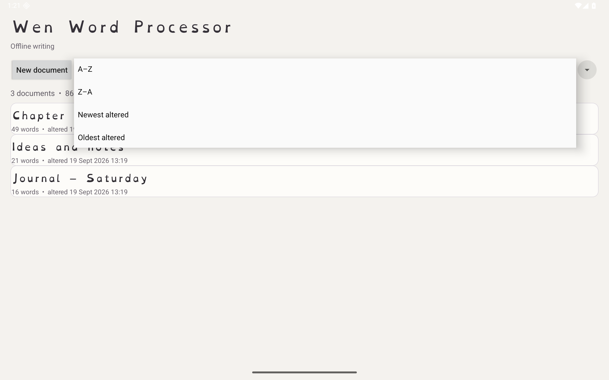
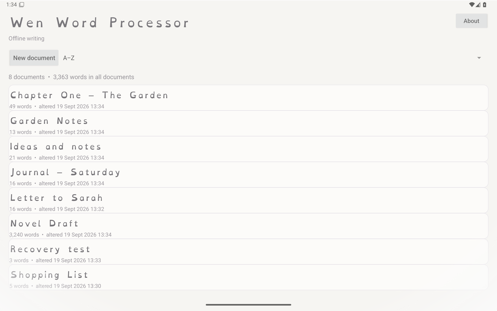

# Wen Word Processor

Wen Word Processor is a deliberately small, fully offline Android word processor from Brimstone, intended for simple, distraction-free writing.

## Core behaviour

- Android 10+ (minSdk 29), target API 37.
- No INTERNET permission and Android cloud backup disabled.
- All documents live in one app-owned `Documents/Wen` folder inside Android's private app storage. Older `Documents/SimpleType` data is migrated automatically.
- Document list sorts A–Z, Z–A, newest altered, or oldest altered.
- Each document shows its own word count; the shelf shows the total word count for all documents.
- Automatic save plus an explicit Save button, atomic file replacement, and interrupted-save recovery.
- Five document font choices: OpenDyslexic, OpenDyslexic 3, OpenDyslexic Mono, Times New Roman, and Caveat.
- Caveat is the Fontsource/Google handwriting family bundled under OFL. Times New Roman uses a licensed system copy when available and otherwise falls back to Android serif; the proprietary Microsoft font file is not redistributed.
- Bold, italic, underline, cut, copy, paste, undo, and redo.
- Android IME integration keeps swipe typing and keyboard prediction available.
- Approximate page number and total pages are shown while writing.

## Offline language features

- Bundled en-GB dictionary for local spelling marks.
- Bundled Vosk speech-recognition engine and model.
- Speech commands include comma, full stop, question mark, exclamation mark, new line, and new paragraph.
- Voice calibration is on the editor toolbar.
- Calibration takes four comfortable samples, estimates the observed pitch range, and derives a safe microphone gain profile.
- Recognition audio is normalised locally using that profile before being passed to Vosk.

## Privacy

The manifest contains RECORD_AUDIO only. It intentionally does not request INTERNET permission.
Android cloud backup is disabled. Documents, dictionary work, calibration data and speech recognition remain on the device.

## Build

Open this directory in Android Studio, or run:

```sh
./gradlew clean assembleDebug lintDebug
```

The debug APK is produced at `app/build/outputs/apk/debug/app-debug.apk`.

Versioned APKs are published as GitHub Release assets in `lurcheous73/wen-word-processor`.

## Screenshots










## Hardening

- Brimstone About panel and brand mark.
- Strict document size/version/font/format validation.
- Corrupt documents are rejected without crashing the shelf.
- Interrupted valid saves preserve the previous target before recovery.
- Invalid recovery files are retained as recovery-failed files rather than silently discarded.
- Editor activity is explicitly non-exported.
- Backup remains disabled and the APK still requests only microphone access.
- Offline Vosk model integrity is checked and damaged model files are rebuilt locally.
- Release builds use R8 code shrinking/resource shrinking, with Vosk/JNA native bindings preserved.

## First hardware test

The important next step is testing dictation with the intended speaker across her normal, high, low, and changing registers.
Calibration measures a very wide pitch window, but recognition quality ultimately depends on the acoustic model and microphone.
